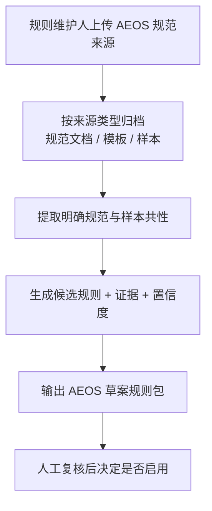

# AEOS 规则反推与草案生成

## Problem Frame

当前仓库已经支持人工维护 `AEOS`、新闻宣传稿、发言稿等规则包，并基于这些规则包执行 `.docx` 标准化检查。但规则包本身仍然需要人工逐条整理和录入，成本高、启动慢，也不利于后续扩展到更多文种。

对于 `AEOS` 这类强规范文档，规则来源通常同时存在于三类材料中：正式规范文档、标准模板文件、基本合格但可能夹杂脏样本的历史文档。真正高价值的能力不是“从单份样本自动猜规则”，而是让系统基于这些材料先生成一版可审阅的 `AEOS` 规则草案，显著缩短规则建模时间，同时保留可解释性和人工把关。

第一版目标不是自动替代规则维护人员，而是在现有 Web 工具中新增一个管理侧流程，用来上传 `AEOS` 规范来源并生成 `rulesets/aeos/` 草案，供人工复核后再启用。

## Requirements

**入口与输入**
- R1. 系统应在现有 Web 工具中提供独立于普通“上传并检验”的管理侧入口，用于生成规则草案。
- R2. 第一版一次只处理一个文种，且仅支持 `AEOS` 规则草案生成，不要求同时处理新闻稿或发言稿。
- R3. 系统应支持按来源类型分别上传多份输入材料，至少包括：正式规范文档、标准模板文件、样本文档。
- R4. 系统应记录每份输入材料的来源类型、文件名、上传时间和所属草案任务，保证后续可追溯。
- R5. 系统应允许规则维护人在生成前或生成后排除明显异常样本，避免脏样本直接污染草案结果。

**规则反推行为**
- R6. 系统应将正式规范文档中的明确约束作为最高优先级依据，用于提取版式、结构、术语和禁用表达等候选规则。
- R7. 系统应将标准模板文件视为强格式信号，用于补充页边距、样式、章节层级、标题格式等模板性规则。
- R8. 系统应将样本文档作为佐证与补充来源，用于归纳共性并验证候选规则是否具有稳定支持度，而不是将单份样本视为最终标准。
- R9. 系统应对样本间冲突、离群样本或支持度不足的候选规则进行降权、标记或搁置，而不是强行写入最终草案。
- R10. 第一版应覆盖现有 `AEOS` 规则包所需的主要规则层：基础元信息与标点开关、结构规则、版式规则、样式规则、术语规则、禁用词规则。
- R11. 当系统无法从来源中获得足够证据时，应输出“待人工确认”或“证据不足”的候选，而不是编造确定性规则。

**草案输出与复核**
- R12. 系统应直接产出可供现有规则引擎消费的 `AEOS` 草案规则包，而不是只输出一份抽象分析报告。
- R13. 系统应为每条候选规则提供证据说明，至少包括来源类型、支持样本数量或支持比例，以及可帮助人工判断的片段或定位信息。
- R14. 系统应明确区分“草案规则”和“当前生效规则”，草案生成不得自动覆盖正在用于文档检查的活动规则集。
- R15. 系统应保留每次草案生成的版本、输入集合、生成时间、目标文种和结果状态，支持后续审计与复现。
- R16. 第一版只要求“生成草案并供人工复核”，不要求在 Web 页面内提供逐条接受/拒绝/编辑的精细化规则推荐工作台。

**治理与安全**
- R17. 规则草案生成入口和草案产物应面向规则维护人或管理员开放，不应暴露给普通起草人作为默认流程。
- R18. 人工维护的术语表、禁用词表或正式规范约束应能覆盖样本统计结论，避免经验样本反向推翻明示标准。
- R19. 系统应支持基于同一批来源重复生成新草案，或在调整输入集合后重新生成，不影响历史草案留痕。

## Success Criteria

- 规则维护人能够基于一批 `AEOS` 规范来源，在一次管理流程中得到首版可复核的 `AEOS` 草案规则包，而不必从零手工编写全部配置。
- 首版草案能够覆盖当前 `AEOS` 规则包的大部分高价值规则层，显著减少人工录入和整理工作量。
- 人工复核者能够看懂每条候选规则“为什么被推断出来”，而不是面对不可解释的黑盒结果。
- 存在脏样本时，系统不会轻易把异常写法直接提升为活动规则，人工复核仍能控制最终启用结果。
- 草案生成流程不会干扰现有普通文档检验流程，未批准的草案不会误伤生产检查结果。

## Scope Boundaries

- 第一版只做 `AEOS`，不同时处理新闻宣传稿、发言稿或自动识别文种。
- 第一版不做“混传多文种再自动聚类”。
- 第一版不要求在页面中逐条接受、拒绝、编辑每条候选规则；重点是先生成完整草案与证据。
- 第一版不要求草案自动生效或自动替换当前活动规则。
- 第一版不追求从样本中完全自动学习复杂语义判断或主观内容质量标准。

## Key Decisions

- **一次只反推一个文种**: 先把 `AEOS` 跑通，降低样本异质性和错误归因风险。
- **规范文档与模板优先于样本统计**: 规则来源是“标准先行”，样本主要用于补充和验证，而不是决定权最高的信号。
- **输出直接落为规则包草案**: 第一版目标是缩短规则建模路径，不是只做研究报告。
- **草案与活动规则隔离**: 反推能力面向规则维护，不得直接影响现有检查结果。
- **管理侧单独流程，而不是塞进普通上传检验入口**: 普通用户的核心目标是检查文档，不是维护规则。
- **先做完整草案，再做细粒度交互**: 比起一开始就做复杂推荐工作台，第一版更应先验证草案质量和证据链是否成立。

## Alternatives Considered

- **继续纯人工维护规则包**: 成本最低，但无法解决新文种启动慢、规则整理重复劳动重的问题。
- **只基于样本文档做规则归纳**: 实现看似简单，但会把脏样本和偶然写法误学成规则，不适合作为第一版。
- **标准优先的混合反推流程**: 由正式规范和模板定义上限，由样本提供佐证与补充，兼顾可解释性与落地价值。第一版推荐此路线。

## High-Level Technical Direction

该能力应采用“规范抽取 + 模板解析 + 样本归纳 + 草案合成”的分层流程：

1. 先按来源类型接收和管理输入材料，而不是把所有文件混为一个样本池。
2. 从正式规范和术语/禁用词资产中提取明确约束，优先形成高置信度候选规则。
3. 从模板和样本文档中抽取结构、版式、样式和共性模式，用于补充与验证候选规则。
4. 对每条候选规则计算证据与置信度，并将冲突项保留为待人工确认项。
5. 将结果输出为可消费的 `AEOS` 草案规则包，并附带一份证据视图或证据清单供人工复核。

## Dependencies / Assumptions

- 已能获得一批相对权威的 `AEOS` 正式规范文档、标准模板文件和历史样本文档。
- 上传材料能够被人工正确区分为“规范文档”“模板文件”“样本文档”三类。
- 规则维护人愿意在草案生成后承担人工复核责任，而不是要求系统自动生效。
- 现有规则包结构仍将作为第一版草案输出的目标格式。

## Outstanding Questions

### Deferred to Planning
- [Affects R6, R10][Technical] 如何将正式规范文档中的自然语言表述稳定映射到现有规则包字段与规则类型？
- [Affects R8, R9][Needs research] 样本支持度、离群样本识别和冲突判定的阈值应如何设置，才能兼顾稳健性与召回率？
- [Affects R12, R13][Technical] 草案规则与证据说明应如何组织，才能既能被机器消费，又便于人工复核？
- [Affects R14, R15][Technical] 草案版本与活动规则版本的切换、留痕和回滚应如何建模？

## Next Steps

- 进入 `/ce:plan` 输出“AEOS 规则反推 Web 能力”的实施方案与分阶段建设路径。
