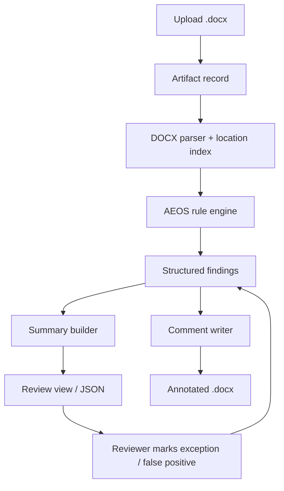
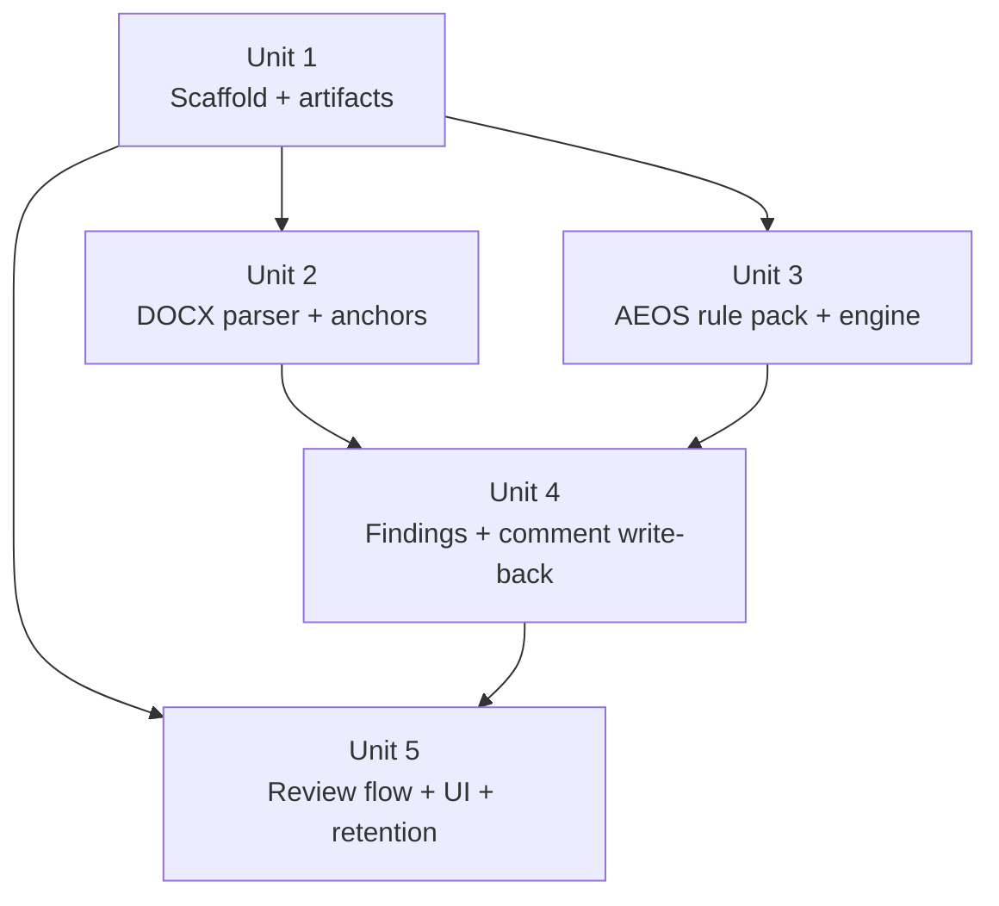

# feat: AEOS DOCX 文档标准化检验服务

## Overview

建设一个面向 `AEOS 制度文件` 的独立文档标准化检验服务，首期仅支持 `.docx` 输入，完成上传、规则检验、问题汇总、批注回写、结果下载和误报标记闭环。交付形态以最小可用 Web 工具为主，后端提供稳定的检验管线和可追溯的规则/结果资产。

## Problem Frame

当前 AEOS 制度文件的标准化检验高度依赖人工逐项核对，格式和内容问题均存在高频、重复、易漏检的特点。来源需求已明确首期边界：

- 试点文种仅做 `AEOS 制度文件`
- 输入仅做 `.docx`
- 输出以回写批注版 `.docx` 为主，并保留汇总视图
- 服务独立提供，不与现有审批流集成
- 不强制内网部署，但必须支持私有化部署与访问控制

本计划对应的目标是交付一套规则驱动、可审计、可扩展的绿地服务，而不是一次性做成覆盖全部文种和全部语义问题的“通用 AI 校对平台”。

## Requirements Trace

- R1, R2, R3. 提供独立入口，首期聚焦 `AEOS 制度文件`，仅支持 `.docx`
- R4, R5, R6. 完成模板、样式、结构与编号连续性检查
- R7, R8, R9, R10. 完成术语、禁用词、标点、基础拼写/语法等内容检查，并区分硬性错误与建议项
- R11, R12, R13, R14, R14a. 生成结构化问题清单、定位信息、规则依据、批注版 `.docx` 和可追溯的检验记录
- R15, R16, R17. 建立 `AEOS` 规则包、版本化规则资产以及误报/例外标记机制
- R18. 满足访问控制、留痕、保留策略和私有化部署要求
- Success Criteria. 将单份检验耗时压缩至 2-5 分钟，并让用户直接基于批注版 `.docx` 复核和修改

## Scope Boundaries

- 不支持 `.pdf`、扫描件、OCR 文档或图片输入
- 不做多文种并行支持，党建请示和新闻宣传稿留待后续规则包扩展
- 不自动改正文档正文，只做发现、定位、建议和批注回写
- 不做跨文档查重、知识问答或复杂语义审稿
- 不在首期内自建完整身份体系；访问控制优先通过私有化部署时的反向代理 / 网关集成承接

### Deferred to Separate Tasks

- 多文种规则包扩展：后续独立迭代
- 与审批流、OA、流程系统集成：后续独立迭代
- 复杂政治口径判断、上下文语义审核增强：后续独立迭代

## Context & Research

### Relevant Code and Patterns

- 当前仓库为绿地仓库，没有可复用的现成实现模式
- 本计划中的目录结构和实现分层将成为该仓库的首套基线约定

### Institutional Learnings

- 当前无 `docs/solutions/` 或既有内部实现可复用

### External References

- [python-docx comments API](https://python-docx.readthedocs.io/en/latest/api/document.html): 支持将批注锚定到一个或多个 `Run`，但批注锚点必须落在合法的 run 边界
- [python-docx user guide: comments](https://python-docx.readthedocs.io/en/latest/user/comments.html): 批注只能加在主文档故事中，不能直接加在 header/footer/comment 内部
- [python-docx paragraph formatting](https://python-docx.readthedocs.io/en/develop/dev/analysis/features/text/paragraph-format.html): 行距、缩进、段前段后等格式检查可从段落/样式层读取
- [python-docx styles](https://python-docx.readthedocs.io/en/stable/user/styles-using.html): 样式继承需要纳入格式判断，不应只看直接格式
- [Microsoft Learn: Structure of a WordprocessingML document](https://learn.microsoft.com/en-us/office/open-xml/word/structure-of-a-wordprocessingml-document): `.docx` 由正文、样式、页眉页脚、批注等多个 part 组成
- [Microsoft Learn: Retrieve comments from a word processing document](https://learn.microsoft.com/en-us/office/open-xml/word/how-to-retrieve-comments-from-a-word-processing-document): 批注内容与正文引用在 Open XML 中分离存储，适合回写后保留审计线索
- [Microsoft Learn: lastRenderedPageBreak](https://learn.microsoft.com/en-us/dotnet/api/documentformat.openxml.wordprocessing.lastrenderedpagebreak?view=openxml-3.0.1): 分页信息依赖上次分页结果，不能把“精确页码”当作唯一可信定位来源

## Key Technical Decisions

- **采用 Python 服务作为 P0 技术底座**: `.docx` 解析、样式读取和批注回写在 Python 生态中更直接，适合绿地快速交付
- **以规则驱动引擎为主，不引入 LLM 作为首期判定核心**: 当前 P0 更需要可解释、可追溯和可验收的确定性检查
- **结构锚点优先于页码锚点**: 章节/段落/运行片段作为主定位；页码仅作为“存在即补充”的最佳努力信息
- **批注输出采用“主文档内联批注 + 汇总视图兜底”双轨设计**: 主文档可批注的问题直接回写；header/footer 等不可批注位置仅进入汇总视图
- **规则资产使用版本化文件管理**: `rulesets/aeos/` 下维护 manifest、结构规则、样式规则、术语库和禁用词库，检验记录必须绑定规则版本
- **误报/例外状态以单次检验为主域**: P0 先支持 artifact 级标记与重生成，不引入部门级全局白名单机制
- **访问控制交由部署边界承接**: 服务默认支持反向代理传入用户身份，应用侧负责留痕、授权钩子和无身份时的本地模式限制

## Open Questions

### Resolved During Planning

- **如何处理页码定位不稳定的问题？**: 以章节/段落/运行锚点为主，若文档包含 `lastRenderedPageBreak` 等分页痕迹则补充页码提示；报告和批注不能以页码作为唯一定位
- **如何处理目录与页码对应校验？**: 优先比对目录条目、标题层级和文档中可取得的分页痕迹；若文档缺少可靠分页信息，则将“目录页码无法可靠验证”作为提示项而不是硬错误
- **如何处理 header/footer 检查结果无法直接批注的问题？**: 这些问题保留在汇总视图中，并使用“节/页眉/页脚 + 片段描述”的合成定位标签
- **如何处理 finding 命中 run 内部子串但批注锚点必须落在 run 边界的问题？**: P0 不主动拆分复杂 run；批注锚定到最小安全 run 范围，同时在批注正文中附带精确证据片段
- **规则包如何版本化？**: 采用文件化规则包，每次检验记录绑定 `ruleset_id + version`
- **误报标记如何落地而不扩大范围？**: P0 只支持本次检验中的 finding 状态调整与结果重生成，跨文档沉淀由人工维护规则包处理

### Deferred to Implementation

- 具体采用 SQLite 还是可替换的轻量 ORM 封装作为 P0 元数据存储，可在 Unit 1 结合部署方式最后确定
- 某些复杂 `.docx` 构造（嵌套表格、异常编号、历史修订残留）是否需要专门兼容逻辑，要在真实样本夹具下逐步硬化
- 若私有化现场已有统一认证网关，其身份透传头名和授权边界要在接入时落定

## Output Structure

```text
docs/
  brainstorms/
    2026-04-22-document-standardization-check-service-requirements.md
  plans/
    2026-04-22-001-feat-aeos-docx-check-service-plan.md
rulesets/
  aeos/
    manifest.yaml
    structure.yaml
    style.yaml
    terminology.csv
    banned_terms.csv
src/
  doc_check/
    main.py
    config.py
    api/
      app.py
      routes/
        checks.py
        reviews.py
    domain/
      documents.py
      findings.py
      rules.py
    parsers/
      docx_reader.py
      location_index.py
    rules/
      rule_pack.py
      engine.py
      checks/
        structure.py
        style.py
        terminology.py
        punctuation.py
    reports/
      comment_writer.py
      summary_builder.py
    services/
      check_pipeline.py
      review_service.py
    persistence/
      models.py
      repositories.py
    web/
      templates/
        upload.html
        review.html
tests/
  fixtures/
    docx/
  unit/
  integration/
```

## High-Level Technical Design

> *This illustrates the intended approach and is directional guidance for review, not implementation specification. The implementing agent should treat it as context, not code to reproduce.*



## Implementation Units



- [x] **Unit 1: 建立服务骨架、配置和检验工件模型**

**Goal:** 建立可运行的服务壳、配置入口、工件存储与审计元数据模型，为后续解析、规则执行和结果下载提供统一边界。

**Requirements:** R1, R3, R14, R18

**Dependencies:** None

**Files:**
- Create: `pyproject.toml`
- Create: `src/doc_check/main.py`
- Create: `src/doc_check/config.py`
- Create: `src/doc_check/api/app.py`
- Create: `src/doc_check/api/routes/checks.py`
- Create: `src/doc_check/domain/documents.py`
- Create: `src/doc_check/persistence/models.py`
- Create: `src/doc_check/persistence/repositories.py`
- Create: `src/doc_check/services/check_pipeline.py`
- Test: `tests/unit/test_config.py`
- Test: `tests/unit/persistence/test_artifact_repository.py`
- Test: `tests/integration/test_artifact_creation_api.py`

**Approach:**
- 明确服务启动方式、配置加载、工件目录约定、元数据字段和生命周期状态
- 为一次检验建立稳定标识，记录上传文件、规则版本、执行状态、输出工件路径、创建者和保留截止时间
- 预留由反向代理透传的用户身份字段，应用侧统一写入审计记录

**Execution note:** 先把“上传工件 -> 持久化元数据 -> 生成检验任务标识”的纵切闭环做通，再扩展后续解析和规则执行。

**Patterns to follow:**
- Greenfield repository; this unit establishes the baseline project conventions for all later units

**Test scenarios:**
- Happy path: 创建一次新检验时，能够写入初始元数据并分配唯一工件目录
- Edge case: 缺少可选身份头时，系统仍可在本地模式下创建受限审计记录
- Error path: 上传非 `.docx` 文件时，服务在入口处拒绝并给出明确错误
- Integration: 服务重启后仍能根据持久化元数据恢复未过期工件记录

**Verification:**
- 服务能够稳定启动
- 新检验的工件创建入口、元数据记录结构和生命周期状态已固定，足以支撑后续单元接入

- [x] **Unit 2: 实现 DOCX 解析与结构定位索引**

**Goal:** 从 `.docx` 中提取正文、章节、段落、样式、页眉页脚、编号和潜在分页痕迹，建立“规则可消费的结构化表示 + 可批注锚点”。

**Requirements:** R4, R5, R6, R12

**Dependencies:** Unit 1

**Files:**
- Create: `src/doc_check/parsers/docx_reader.py`
- Create: `src/doc_check/parsers/location_index.py`
- Modify: `src/doc_check/domain/documents.py`
- Test: `tests/unit/parsers/test_docx_reader.py`
- Test: `tests/unit/parsers/test_location_index.py`
- Test: `tests/integration/test_docx_fixture_parsing.py`
- Test: `tests/fixtures/docx/aeos-valid-sample.docx`
- Test: `tests/fixtures/docx/aeos-format-errors.docx`

**Approach:**
- 解析正文 story、页眉页脚、段落/运行、样式继承、章节编号和目录字段
- 建立统一 `LocationRef` 抽象，至少包含：story 类型、章节路径、段落序号、运行范围、文本摘要和可选页码提示
- 将目录校验所需的标题结构、目录条目和可用分页痕迹统一编入快照，供规则层决定“硬错误”还是“提示项”
- 将“可批注锚点”和“仅可汇总定位”的位置显式区分，避免后续报告生成阶段再做隐式猜测

**Execution note:** 对解析器采用样本文档驱动的表征测试，先锁定真实 `.docx` 结构，再补规则层能力。

**Technical design:** *(directional guidance, not implementation specification)*

```text
DocumentSnapshot
├── main_story: ParagraphNode[]
├── headers: HeaderSnapshot[]
├── footers: FooterSnapshot[]
├── toc_entries: TocEntry[]
└── anchors:
    ├── commentable: LocationRef[]
    └── summary_only: LocationRef[]
```

**Patterns to follow:**
- [python-docx paragraph formatting](https://python-docx.readthedocs.io/en/develop/dev/analysis/features/text/paragraph-format.html)
- [python-docx styles](https://python-docx.readthedocs.io/en/stable/user/styles-using.html)
- [Microsoft Learn: Structure of a WordprocessingML document](https://learn.microsoft.com/en-us/office/open-xml/word/structure-of-a-wordprocessingml-document)

**Test scenarios:**
- Happy path: 标准 AEOS 文档能被解析成正文、页眉页脚、章节路径和样式视图
- Edge case: 段落未显式设置格式但从样式继承时，索引仍能得到有效格式值
- Edge case: 文档带有 `lastRenderedPageBreak` 时，索引能补充页码提示但不依赖它作为唯一定位
- Error path: 结构损坏或缺少关键 part 的 `.docx` 被标记为不可检验并返回明确原因
- Integration: 一个可批注 finding 能稳定映射回合法 run 范围；header/footer finding 会被标记为 `summary_only`

**Verification:**
- 后续规则引擎可以只依赖结构化快照和定位索引，而不必直接操作原始 `.docx`

- [x] **Unit 3: 构建 AEOS 规则包格式和确定性检查引擎**

**Goal:** 将 AEOS 标检标准、术语库和禁用词库沉淀为可版本化规则包，并输出结构化 findings。

**Requirements:** R2, R4, R5, R6, R7, R8, R9, R10, R15, R16

**Dependencies:** Unit 1

**Files:**
- Create: `rulesets/aeos/manifest.yaml`
- Create: `rulesets/aeos/structure.yaml`
- Create: `rulesets/aeos/style.yaml`
- Create: `rulesets/aeos/terminology.csv`
- Create: `rulesets/aeos/banned_terms.csv`
- Create: `src/doc_check/domain/rules.py`
- Create: `src/doc_check/rules/rule_pack.py`
- Create: `src/doc_check/rules/engine.py`
- Create: `src/doc_check/rules/checks/structure.py`
- Create: `src/doc_check/rules/checks/style.py`
- Create: `src/doc_check/rules/checks/terminology.py`
- Create: `src/doc_check/rules/checks/punctuation.py`
- Test: `tests/unit/rules/test_rule_pack_loader.py`
- Test: `tests/unit/rules/test_structure_checks.py`
- Test: `tests/unit/rules/test_style_checks.py`
- Test: `tests/unit/rules/test_terminology_checks.py`
- Test: `tests/unit/rules/test_punctuation_checks.py`
- Test: `tests/integration/test_aeos_ruleset_execution.py`

**Approach:**
- 将规则分为结构类、样式类、术语类、禁用词/模式类四类，统一输出 finding 严重级别、证据片段、规则来源和定位
- 为“确定性错误”和“建议性提示”建立显式字段，避免混淆强规则与软建议
- 规则执行不直接依赖 Web 层和报告层，保证后续文种扩展只需要新增规则包和少量新检查器

**Patterns to follow:**
- [python-docx styles](https://python-docx.readthedocs.io/en/stable/user/styles-using.html)
- [Microsoft Learn: comments retrieval and part model](https://learn.microsoft.com/en-us/office/open-xml/word/how-to-retrieve-comments-from-a-word-processing-document)

**Test scenarios:**
- Happy path: 合规样本文档执行规则后返回空 findings 或仅信息级提示
- Edge case: 同一段同时违反样式和术语规则时，结果会保留多条 findings，而不是被后者覆盖
- Edge case: 建议项和错误项在输出中有稳定区分，排序和展示策略一致
- Error path: 规则包缺失、版本不合法或字段定义错误时，执行前即失败并记录配置错误
- Integration: 规则执行结果包含完整 `rule_id`, `ruleset_version`, `severity`, `location_ref`, `evidence`

**Verification:**
- AEOS 规则包可独立加载、执行和版本追踪，成为后续扩文种的清晰边界

- [x] **Unit 4: 生成结构化报告并回写批注版 DOCX**

**Goal:** 将 findings 聚合成用户可消费的汇总结果，并把可批注问题回写到原始 `.docx` 的对应文本范围。

**Requirements:** R11, R12, R13, R14, R14a

**Dependencies:** Unit 2, Unit 3

**Files:**
- Create: `src/doc_check/domain/findings.py`
- Create: `src/doc_check/reports/summary_builder.py`
- Create: `src/doc_check/reports/comment_writer.py`
- Test: `tests/unit/reports/test_summary_builder.py`
- Test: `tests/unit/reports/test_comment_writer.py`
- Test: `tests/integration/test_annotated_docx_output.py`
- Test: `tests/fixtures/docx/aeos-commentable-sample.docx`

**Approach:**
- 定义统一的 finding 展示模型，包含定位文本、规则依据、严重级别、建议文案和输出策略
- 对 commentable findings 使用 run 范围回写批注；对 summary-only findings 仅进入汇总视图
- 对命中 run 内部子串的 finding，不在 P0 中执行激进的 run 拆分；改为锚定最小安全 run 范围并在批注中展示命中片段
- 批注内容要包含“问题类型 + 依据 + 修改建议 + 可选证据片段”，让用户无需打开系统界面也能在 Word 中完成大部分修改

**Execution note:** 对批注回写使用样本文档回归测试，优先防止“文档可打开但格式损坏”这类高代价错误。

**Patterns to follow:**
- [python-docx comments API](https://python-docx.readthedocs.io/en/latest/api/document.html)
- [python-docx user guide: comments](https://python-docx.readthedocs.io/en/latest/user/comments.html)

**Test scenarios:**
- Happy path: 正文中的术语错误被成功写成可见批注，Word 可正常打开文档
- Edge case: finding 命中不可批注位置时，输出不会失败，而是进入汇总视图并保留定位标签
- Edge case: finding 仅命中某个 run 的局部文本时，批注会锚定安全 run 范围，并在正文中展示精确命中片段
- Edge case: 同一位置多个 findings 时，系统按稳定顺序生成批注，避免重复或覆盖
- Error path: 某个 finding 无法映射为合法 run 边界时，系统降级为 summary-only，而不是中断整份文档输出
- Integration: 汇总视图与批注版 `.docx` 中的问题数量、规则标识和严重级别保持一致

**Verification:**
- 用户能够下载一份可正常打开、批注可见、与结构化 findings 一致的 `.docx`

- [x] **Unit 5: 交付检验流程、复核界面和例外管理闭环**

**Goal:** 提供最小可用上传/复核体验，支持发起检验、查看汇总、下载批注版文档、标记误报/例外和按保留策略清理工件。

**Requirements:** R1, R11, R14a, R17, R18

**Dependencies:** Unit 1, Unit 4

**Files:**
- Modify: `src/doc_check/api/routes/checks.py`
- Create: `src/doc_check/api/routes/reviews.py`
- Create: `src/doc_check/services/review_service.py`
- Create: `src/doc_check/web/templates/upload.html`
- Create: `src/doc_check/web/templates/review.html`
- Modify: `src/doc_check/api/app.py`
- Test: `tests/integration/test_check_flow.py`
- Test: `tests/integration/test_review_actions.py`
- Test: `tests/integration/test_retention_cleanup.py`
- Test: `tests/unit/services/test_review_service.py`

**Approach:**
- 提供最小 Web 界面：上传页面、结果页、分组汇总列表、下载入口、finding 状态更新动作
- 复核动作至少支持：保持原判、标记误报、标记可接受例外，并保留操作人和时间
- 工件保留策略采用配置化过期时间；清理后保留必要审计元数据但删除原文与输出附件

**Execution note:** 这里优先做“一个人能顺畅完成一份文件的上传-复核-下载”主流程，不扩展到复杂工作台或多人协同。

**Patterns to follow:**
- Greenfield repository; keep the UI server-rendered and minimal to reduce frontend carrying cost

**Test scenarios:**
- Happy path: 用户上传 `.docx` 后能看到汇总结果并下载批注版文档
- Edge case: 某些 findings 仅存在于汇总视图时，页面仍清楚区分“已写入批注”和“仅摘要展示”
- Edge case: 用户将 finding 标记为误报后，重生成的汇总视图不再把该 finding 计入待处理数量
- Error path: 工件过期后下载请求返回明确状态，且不会暴露已删除文件路径
- Integration: 一次完整检验流程会留下上传、执行、复核、下载、清理的审计轨迹

**Verification:**
- 一个审核人员无需额外系统培训，就能基于 Web 页面和批注版 `.docx` 完成一次完整复核

## System-Wide Impact

- **Interaction graph:** 上传入口、检验管线、规则包、报告构建器、批注回写器、审计/工件存储会形成一条串联主链路，任何一步失败都必须带着上下文返回到检验记录
- **Error propagation:** 解析失败、规则包错误、批注回写降级、工件过期都应形成可展示的用户级状态，而不是仅停留在日志中
- **State lifecycle risks:** 检验过程中会同时存在原始 `.docx`、结构化 findings、批注版 `.docx` 和复核状态；必须避免只清理文件不清理元数据或反之
- **API surface parity:** Web 页面与后端 API 的结果口径必须共用同一组展示模型，避免批注版、页面汇总和审计记录三套口径
- **Integration coverage:** 需要跨层验证“规则命中 -> location_ref -> comment writer -> review state -> regenerated summary”整链路
- **Unchanged invariants:** 首期不修改原文正文内容、不接入外部审批流、不对复杂语义问题给出自动裁决

## Risks & Dependencies

| Risk | Mitigation |
|------|------------|
| `.docx` 分页不是稳定存储属性，导致页码提示不可靠 | 将结构锚点作为主定位，页码仅作补充信息 |
| Word 批注不能覆盖所有 story/位置 | 明确 `commentable` 与 `summary_only` 双通道输出，避免错误承诺“全部内联批注” |
| 真实 AEOS 样本存在样式继承、目录字段、异常编号等复杂结构 | 以样本文档夹具驱动解析器和规则器硬化，先覆盖高频模板 |
| 规则包持续演化，误报容易侵蚀用户信任 | 强制绑定规则版本、保留 finding 状态和操作审计，并把误报处理纳入复核流程 |
| 私有化部署环境的认证方式不统一 | 应用侧采用可插拔身份上下文模型，把认证责任尽量前移到部署边界 |

## Documentation / Operational Notes

- 编写 `README`，说明本地启动、规则包目录结构、工件目录和私有化部署前提
- 编写 `docs/rulesets/aeos-authoring.md`，约定规则字段、示例、版本发布方法和术语库维护方式
- 为测试夹具建立最小样本集：合规样本、样式错误样本、术语错误样本、header/footer 问题样本
- 明确保留策略的默认值、清理行为和被清理后的可见提示

## Sources & References

- **Origin document:** [docs/brainstorms/2026-04-22-document-standardization-check-service-requirements.md](docs/brainstorms/2026-04-22-document-standardization-check-service-requirements.md)
- External docs: [python-docx comments API](https://python-docx.readthedocs.io/en/latest/api/document.html)
- External docs: [python-docx user guide: comments](https://python-docx.readthedocs.io/en/latest/user/comments.html)
- External docs: [python-docx paragraph formatting](https://python-docx.readthedocs.io/en/develop/dev/analysis/features/text/paragraph-format.html)
- External docs: [Microsoft Learn: Structure of a WordprocessingML document](https://learn.microsoft.com/en-us/office/open-xml/word/structure-of-a-wordprocessingml-document)
- External docs: [Microsoft Learn: Retrieve comments from a word processing document](https://learn.microsoft.com/en-us/office/open-xml/word/how-to-retrieve-comments-from-a-word-processing-document)
- External docs: [Microsoft Learn: lastRenderedPageBreak](https://learn.microsoft.com/en-us/dotnet/api/documentformat.openxml.wordprocessing.lastrenderedpagebreak?view=openxml-3.0.1)
