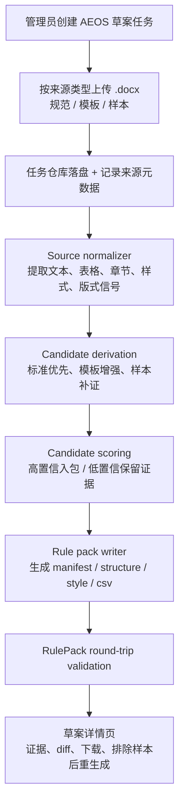

# feat: AEOS 规则草案反推 Web 流程

## Overview

在现有 `doc-check` Web 工具中新增一个管理侧流程，用于上传 `AEOS` 规范文档、标准模板和样本文档，自动生成一版带证据说明的 `AEOS` 规则草案包。第一版重点是缩短规则建模时间，而不是自动激活草案或做细粒度逐条审批工作台。

## Problem Frame

当前仓库已经能消费 `rulesets/aeos/` 并执行文档检查，但规则包本身仍然完全依赖人工整理。来源需求已经明确，第一版应满足这些边界（见 origin: `docs/brainstorms/2026-04-22-aeos-ruleset-reverse-derivation-requirements.md`）：

- 面向规则维护人提供独立于普通“上传并检验”的管理侧入口
- 一次只处理一个文种，首期只做 `AEOS`
- 输入同时包含正式规范文档、标准模板文件、样本文档
- 输出直接落为可被现有规则引擎消费的草案规则包
- 草案与活动规则隔离，生成后不得自动替换 `rulesets/aeos`

本计划的核心不是做“通用 AI 猜规则”，而是围绕现有 `.docx` 解析和规则包结构，交付一个标准优先、样本补充、证据可追溯的规则草案生成流程。

## Requirements Trace

- R1, R2, R17. 提供 `AEOS` 专用的管理侧入口，并对普通起草人默认隐藏
- R3, R4, R5, R19. 支持按来源类型上传多份材料、留痕、排除异常样本并可重复生成
- R6, R7, R8, R9, R18. 以正式规范和模板为高优先级信号，样本只做补充、验证和冲突判定
- R10, R12. 产出符合当前 `RulePack` 合同的 `manifest / structure / style / terminology / banned_terms` 草案文件
- R11, R13. 为每条候选规则保留证据、支持度和“证据不足”状态，不编造确定性结论
- R14, R15, R16. 草案与活动规则隔离，保留版本与输入集合，第一版不做逐条接受/拒绝工作台
- Success Criteria. 让规则维护人可在一次流程中得到可复核草案，显著降低手工整理成本，同时不影响现有普通检查流程

## Scope Boundaries

- 第一版只处理 `AEOS`，不同时覆盖新闻宣传稿、发言稿或自动识别文种
- 第一版只处理用户已标注来源类型的材料，不做多文种混传后自动聚类
- 第一版不自动激活草案，不直接改写 `rulesets/aeos/`
- 第一版不做逐条 accept/reject/edit 的精细化规则推荐工作台
- 第一版不追求从样本文本中自动学习复杂语义质量规则或主观写作风格判断

### Deferred to Separate Tasks

- 草案一键激活或回滚活动规则：后续独立迭代
- 新闻稿、发言稿等其他文种的规则反推：后续独立迭代
- 非 `.docx` 规范来源（如扫描件、OCR PDF）的导入：后续独立迭代
- 逐条规则审批、在线编辑、多人协作审阅：后续独立迭代

## Context & Research

### Relevant Code and Patterns

- `src/doc_check/api/routes/reviews.py` 和 `src/doc_check/web/templates/*.html` 已经建立了当前 Web 页面、表单提交、详情页和下载页的实现模式，适合作为管理侧新流程的入口样式与路由组织方式。
- `src/doc_check/services/check_pipeline.py`、`src/doc_check/services/check_execution.py`、`src/doc_check/services/review_service.py` 已经建立了“上传 -> 落盘 -> 持久化 -> 处理 -> 详情页消费”的生命周期模式，适合作为草案任务模型的参考。
- `src/doc_check/persistence/models.py` 和 `src/doc_check/persistence/repositories.py` 当前使用 SQLite + 轻量 repository 模式，没有 ORM，新增草案任务表和来源文件表时应沿用同一风格。
- `src/doc_check/parsers/docx_reader.py` 已能提取正文、页眉页脚、章节路径、样式继承、版式参数、目录条目和表格中的段落内容，说明第一版可以继续围绕 `.docx` 做规范和模板输入，而不必立即扩展到其他格式。
- `src/doc_check/rules/rule_pack.py` 是当前规则包输出合同，草案生成的最终产物必须能通过该加载器 round-trip 验证。
- `src/doc_check/services/rule_catalog.py` 和 `tests/integration/test_rules_pages.py` 已经有“规则包说明页”的展现模式，后续草案详情页和活动规则 diff 可以沿用同一思路。

### Institutional Learnings

- 当前仓库没有 `docs/solutions/` 或既有制度化经验文档可直接复用。

### External References

- 本次 planning 未额外引入外部资料。现有仓库已经提供 FastAPI、SQLite、模板渲染、`.docx` 解析和规则包加载的主要模式，足以支撑第一版设计。

## Key Technical Decisions

- **为草案生成建立独立生命周期，而不是复用文档检查 artifact 模型**: 草案任务和普通检查在输入、状态机、产物和风险上都不同，继续塞进 `ArtifactRecord` 会混淆活动规则与临时草案职责。
- **第一版只接受 `.docx` 叙述性来源**: 现有解析器已覆盖段落、表格、页眉页脚、目录和样式继承，足以支撑规范文档、模板和样本文档的主要信号提取；非 `.docx` 来源留到后续扩展。
- **候选规则采用“标准优先、样本补证”的加权模型**: 正式规范 > 标准模板 > 样本文档，样本冲突只降低置信度或转入待确认，不得推翻明示标准。
- **只把高置信候选编译进草案规则包，低置信候选留在证据视图中**: 当前 `RulePack` 文件格式无法表达“待确认”状态，因此草案包和候选证据清单必须分层输出。
- **草案输出合同严格对齐当前 `rulesets` 结构**: 生成结果仍然是 `manifest.yaml`、`structure.yaml`、`style.yaml`、`terminology.csv`、`banned_terms.csv`，并通过 `load_rule_pack` 自检，避免另起一套规则 DSL。
- **活动规则只作为基线与 diff 参照，不作为自动覆盖目标**: 第一版可参考当前活动 `AEOS` 规则补齐低熵元数据字段，但生成结果仍然写入独立草案目录，由人工下载和启用。
- **管理侧访问通过现有代理身份头 + 配置化管理员白名单承接**: 仓库目前没有角色系统，第一版不新增完整权限模型，只为管理入口增加最小授权边界。

## Open Questions

### Resolved During Planning

- **如何将规范文档中的自然语言表述稳定映射到现有规则类型？**: 第一版采用确定性“规范语句抽取 -> 归一化候选模型 -> 编译到规则包”的三段式流程，优先识别“应/宜/不得/统一使用/禁止”等规范提示词，并结合表格/标题结构抽取词表和约束。
- **如何避免脏样本污染规则？**: 用户在上传时显式标注来源类型；系统按来源类型分权重；低支持度或冲突候选不直接写入草案；管理页允许排除异常样本后重新生成。
- **如何保证草案不会误伤现有检查流程？**: 草案任务写入独立数据目录并输出独立包；详情页只展示 diff 和下载能力；不提供直接覆盖活动规则的路径。
- **如何处理无法稳定从来源中反推出的低熵元信息？**: `ruleset_id`、`document_type` 和当前启用的标点开关等字段允许从目标 `AEOS` 基线清单继承，但继承字段必须在证据清单中标记为“基线继承”而非“自动发现”。
- **管理入口如何在现有身份模型下落地？**: 复用 `resolve_user_context()` 获取代理透传身份，在配置中增加管理员白名单，对管理入口进行最小授权控制。

### Deferred to Implementation

- 样本支持度、离群阈值和候选晋级阈值的具体数值，需要结合真实夹具调试后定型
- 规范语句和表格词表抽取的具体启发式，可能需要针对真实 `AEOS` 文档的版式差异做补丁
- 草案 diff 在详情页中呈现为纯文本、分组表格还是结构化 JSON 视图，可在实现时根据模板复杂度收敛
- 若部分规范文档存在复杂页眉、文本框或嵌套表格，是否需要扩展 `docx_reader` 的覆盖面，应在执行阶段根据样本决定

## Output Structure

```text
docs/
  brainstorms/
    2026-04-22-aeos-ruleset-reverse-derivation-requirements.md
  plans/
    2026-04-22-002-feat-aeos-ruleset-derivation-plan.md
src/
  doc_check/
    api/
      routes/
        rule_drafts.py
    domain/
      derivation.py
      rule_drafts.py
    services/
      rule_draft_catalog.py
      rule_draft_pipeline.py
      rule_derivation.py
      source_normalizer.py
      rule_pack_writer.py
    web/
      templates/
        rule_draft_upload.html
        rule_draft_detail.html
tests/
  integration/
    test_rule_draft_flow.py
    test_rule_draft_pages.py
  unit/
    persistence/
      test_rule_draft_repository.py
    services/
      test_rule_derivation.py
      test_rule_draft_pipeline.py
      test_source_normalizer.py
```

## High-Level Technical Design

> *This illustrates the intended approach and is directional guidance for review, not implementation specification. The implementing agent should treat it as context, not code to reproduce.*



## Implementation Units

- [x] **Unit 1: 建立草案任务模型、授权边界和管理入口**

**Goal:** 新增规则草案任务的生命周期模型、最小授权控制和管理页入口，为后续来源上传和草案生成提供稳定壳层。

**Requirements:** R1, R2, R4, R15, R17, R19

**Dependencies:** None

**Files:**
- Modify: `src/doc_check/config.py`
- Modify: `src/doc_check/api/app.py`
- Modify: `src/doc_check/persistence/models.py`
- Modify: `src/doc_check/persistence/repositories.py`
- Create: `src/doc_check/domain/rule_drafts.py`
- Create: `src/doc_check/api/routes/rule_drafts.py`
- Create: `src/doc_check/web/templates/rule_draft_upload.html`
- Modify: `src/doc_check/web/templates/upload.html`
- Test: `tests/unit/persistence/test_rule_draft_repository.py`
- Test: `tests/integration/test_rule_draft_pages.py`

**Approach:**
- 引入与普通文档检查并行的 `RuleDraftTask` / `RuleDraftSource` / `RuleDraftStatus` 模型，单独记录任务、来源文件、生成状态、目标文种和输出目录。
- 在配置中增加草案工作目录和管理员白名单，继续复用现有代理身份头，不引入新身份体系。
- 管理侧入口挂到新的 `/rule-drafts` 路由，并在首页只对管理员显示入口链接，避免与普通“上传并检验”主流程混淆。
- Repository 继续沿用 SQLite + 手写 SQL 模式，保持与当前 `ArtifactRepository` 风格一致。

**Execution note:** 先用失败的页面级集成测试锁定“管理员可见、普通用户不可见、可创建空草案任务”这条主链路，再补模型细节。

**Patterns to follow:**
- `src/doc_check/api/routes/reviews.py`
- `src/doc_check/services/check_pipeline.py`
- `src/doc_check/persistence/repositories.py`

**Test scenarios:**
- Happy path: 管理员访问 `/rule-drafts` 时能看到创建任务页面，并能成功创建一个新的 `AEOS` 草案任务。
- Edge case: 未透传身份头但处于本地模式时，系统按配置决定是否允许进入管理页，不应默认开放。
- Error path: 非管理员身份提交创建请求时返回拒绝，而不是创建任务成功。
- Integration: 首页对管理员显示“规则草案生成”入口，对普通用户隐藏该入口，且不影响原有 `/reviews/upload` 流程。

**Verification:**
- 草案任务可被持久化、检索和展示，且管理入口不会破坏普通文档检查页面。

- [x] **Unit 2: 实现来源文件接收、落盘与规范化快照**

**Goal:** 让草案任务能够接收按来源类型标注的 `.docx` 文件，并将其转换为后续规则反推可消费的标准化信号快照。

**Requirements:** R3, R4, R5, R6, R7, R8, R13, R19

**Dependencies:** Unit 1

**Files:**
- Create: `src/doc_check/domain/derivation.py`
- Create: `src/doc_check/services/rule_draft_pipeline.py`
- Create: `src/doc_check/services/source_normalizer.py`
- Modify: `src/doc_check/parsers/docx_reader.py`
- Modify: `src/doc_check/api/routes/rule_drafts.py`
- Test: `tests/unit/services/test_source_normalizer.py`
- Test: `tests/integration/test_rule_draft_flow.py`
- Test: `tests/support/docx_samples.py`

**Approach:**
- 要求用户在上传时显式标注来源类型：`standard`、`template`、`sample`，系统不在第一版做自动分类。
- 沿用 `docx_reader` 解析正文、标题层级、目录、页眉页脚、表格段落、段落样式和页面版式，并在 `source_normalizer` 中补充 derivation 关心的聚合指标。
- 每个来源文件都要保留原始文件、副本路径、来源类型、是否已排除、规范化快照和解析错误信息，便于后续重跑与审计。
- 规范化结果应突出后续 derivation 所需的稳定信号，而不是直接耦合到最终 `RulePack` 文件结构。

**Patterns to follow:**
- `src/doc_check/parsers/docx_reader.py`
- `src/doc_check/domain/documents.py`
- `tests/unit/parsers/test_docx_reader.py`

**Test scenarios:**
- Happy path: 上传一组包含规范、模板、样本的 `.docx` 来源后，系统能为每份文件生成可读取的规范化快照并挂到对应草案任务上。
- Edge case: 样本文件被标记为排除后，再次运行规范化时不再参与聚合，但历史来源记录仍保留。
- Error path: 上传非 `.docx` 文件、空文件或超限文件时，系统拒绝该来源并给出明确错误，不创建脏记录。
- Integration: 规范化快照能保留表格、标题层级、页眉页脚和版式信息，足以支撑后续结构、样式和词表规则提取。

**Verification:**
- 每个草案任务下都能看到来源文件及其规范化状态；后续 derivation 不需要重新直读原文件细节就能拿到稳定输入。

- [x] **Unit 3: 构建结构、版式、样式候选规则与证据评分**

**Goal:** 基于规范文档、模板和样本的组合信号，生成结构规则、版式规则、样式规则及基础元信息候选，并给出证据与置信度。

**Requirements:** R6, R7, R8, R9, R10, R11, R13, R18

**Dependencies:** Unit 2

**Files:**
- Modify: `src/doc_check/domain/derivation.py`
- Create: `src/doc_check/services/rule_derivation.py`
- Modify: `src/doc_check/services/rule_draft_pipeline.py`
- Test: `tests/unit/services/test_rule_derivation.py`
- Test: `tests/integration/test_rule_draft_flow.py`

**Approach:**
- 先建立统一候选模型，覆盖：标题/目录/页眉页脚等结构候选，页面尺寸与页边距等版式候选，正文段落样式等样式候选，以及 `manifest` 所需的基线元信息。
- 规范文档中的规范语句作为一级信号，模板中的实际格式作为二级信号，样本文档中的共性作为三级信号；候选评分和冲突解决必须显式记录信号来源。
- 对冲突样本、孤立样本和支持度不足的候选不直接写入规则包，而是保留为待确认证据项。
- `manifest` 中无法稳定反推的低熵字段允许继承当前 `AEOS` 活动基线，但需在证据中注明继承来源。

**Technical design:** *(directional guidance, not implementation specification)*

```text
CandidateEvidence
├── candidate_key
├── candidate_kind (heading/layout/style/manifest)
├── source_votes[]
│   ├── source_type
│   ├── source_id
│   ├── observed_value
│   └── weight
├── confidence
└── decision (include_in_pack | evidence_only)
```

**Patterns to follow:**
- `src/doc_check/rules/rule_pack.py`
- `src/doc_check/services/rule_catalog.py`
- `tests/unit/rules/test_rule_pack_loader.py`

**Test scenarios:**
- Happy path: 当规范、模板和样本一致时，系统能生成 required headings、TOC、版式和正文样式等高置信候选，并附带清晰证据。
- Edge case: 当单个样本的页边距或字体偏离模板共识时，系统将其视为冲突证据而不是直接改写候选结果。
- Edge case: 当规范文档明确要求某标题或页眉文本时，即使样本支持不足，也能产出高优先级候选或至少 evidence-only 候选。
- Error path: 当某类候选缺乏足够证据时，系统将其标记为 evidence-only，而不是输出不完整或非法规则配置。
- Integration: 结构、版式、样式候选输出的字段名与当前 `RulePack` 可接受的字段保持一致，不引入额外 DSL。

**Verification:**
- 候选结果能够清楚区分“入包规则”和“仅证据候选”，并能解释每条结构、版式、样式规则的支持来源。

- [x] **Unit 4: 生成术语/禁用词候选并组装可加载的草案规则包**

**Goal:** 生成词表类候选，写出完整草案规则包及其证据清单，并通过当前规则加载器完成 round-trip 自检。

**Requirements:** R10, R11, R12, R13, R14, R15, R18, R19

**Dependencies:** Unit 3

**Files:**
- Create: `src/doc_check/services/rule_pack_writer.py`
- Modify: `src/doc_check/services/rule_derivation.py`
- Modify: `src/doc_check/services/rule_draft_pipeline.py`
- Test: `tests/unit/services/test_rule_draft_pipeline.py`
- Test: `tests/unit/rules/test_rule_pack_loader.py`
- Test: `tests/integration/test_rule_draft_flow.py`
- Test: `tests/support/docx_samples.py`

**Approach:**
- 从规范文档中的词表段落、表格内容和规范语句中抽取 preferred term / banned term 候选；样本只用于验证出现频次和冲突情况，不直接决定词表结论。
- 将高置信候选编译为 `manifest.yaml`、`structure.yaml`、`style.yaml`、`terminology.csv`、`banned_terms.csv`，将全部候选与支持证据写入独立 `evidence.json` 或同类辅助文件。
- 写包后立即使用 `load_rule_pack()` 做 round-trip 验证，确保生成草案能被现有引擎和规则说明页消费。
- 同时生成“草案 vs 当前活动 AEOS 规则”的差异摘要，供详情页展示和人工复核。

**Patterns to follow:**
- `src/doc_check/rules/rule_pack.py`
- `src/doc_check/services/rule_catalog.py`
- `rulesets/aeos/`

**Test scenarios:**
- Happy path: 给定包含规范词表和模板约束的来源集合时，系统能写出完整草案包，并被 `load_rule_pack()` 成功加载。
- Edge case: 某个术语候选只有规范文档命中而样本尚未覆盖时，系统仍可按高优先级来源输出候选，并在证据中说明支持来源结构。
- Error path: 当候选写包后缺少必需字段或字段类型不合法时，round-trip 校验失败，任务应标为失败而不是输出坏包。
- Integration: 生成的草案包与当前 `ruleset guide` 机制兼容，后续可以被详情页或说明页复用展示。

**Verification:**
- 每次成功生成后都能得到一个可加载的草案规则包、一份证据清单和一份与当前活动规则的差异摘要。

- [x] **Unit 5: 完成草案详情页、样本排除重生成与下载流程**

**Goal:** 让管理员能够在 Web 页面中查看草案状态、证据、来源列表、差异摘要，并在排除异常样本后重新生成草案和下载结果。

**Requirements:** R5, R12, R13, R14, R15, R16, R17, R19

**Dependencies:** Unit 4

**Files:**
- Create: `src/doc_check/services/rule_draft_catalog.py`
- Modify: `src/doc_check/api/routes/rule_drafts.py`
- Create: `src/doc_check/web/templates/rule_draft_detail.html`
- Modify: `src/doc_check/web/rendering.py`
- Test: `tests/integration/test_rule_draft_pages.py`
- Test: `tests/integration/test_rule_draft_flow.py`

**Approach:**
- 详情页展示任务元数据、来源文件及来源类型、是否排除、生成状态、当前草案版本、证据摘要和与活动规则的差异。
- 提供“排除来源并重生成”“下载草案包”“查看 evidence-only 候选”的管理动作，但不提供“立即激活活动规则”的动作。
- 重生成要基于同一草案任务保留历史版本与留痕，避免排除样本后覆盖掉先前草案记录。
- UI 继续沿用当前模板渲染风格，不引入新的前端框架。

**Patterns to follow:**
- `src/doc_check/api/routes/reviews.py`
- `src/doc_check/web/templates/review.html`
- `tests/integration/test_rules_pages.py`

**Test scenarios:**
- Happy path: 管理员创建任务、上传来源、成功生成草案后，详情页能展示草案摘要、来源列表和下载链接。
- Edge case: 管理员将某个异常样本标记为排除后重新生成，新的草案版本反映更新后的候选与 diff，而历史版本仍可追溯。
- Error path: 某次生成失败时，详情页仍能显示失败状态、保留来源记录，并允许修正输入后再次重跑。
- Integration: 新增管理页不影响原有 `/reviews/{artifact_id}`、`/rules` 和上传页行为，且未激活草案不会被普通检查流程误用。

**Verification:**
- 管理员可以在同一个 Web 流程里完成草案生成、异常样本排除、重生成和草案下载，而普通文档检查流程保持不变。

## System-Wide Impact

- **Interaction graph:** 新增 `/rule-drafts` 管理流会接入 `AppConfig`、SQLite repository、`.docx` 解析器、规则包写出器和模板渲染层，但不改变现有 `/checks` 和 `/reviews` 主流程。
- **Error propagation:** 草案生成中的解析错误、写包错误和 round-trip 校验错误都应停留在草案任务域内，不应污染活动规则目录或影响现有文档检验能力。
- **State lifecycle risks:** 草案任务会引入新的长期目录、来源文件和版本历史，需要明确清理策略，避免与普通 artifact 目录混放导致误删。
- **API surface parity:** 普通用户 API 无需新增行为；管理入口只增加新的 HTML/POST 流程，不改变现有检查接口合同。
- **Integration coverage:** 页面级集成测试必须覆盖“管理员入口 + 任务创建 + 多来源上传 + 生成成功/失败 + 排除样本重生成”的整条跨层链路。
- **Unchanged invariants:** `rulesets/aeos/` 仍是当前活动规则合同；普通文档检查继续使用活动规则，不读取未激活草案目录。

## Risks & Dependencies

| Risk | Mitigation |
|------|------------|
| 规范文档中的自然语言太松散，难以稳定映射到规则字段 | 先限定为确定性规范语句与结构化表格线索；低置信候选只进证据清单，不强制入包 |
| 样本质量参差不齐，可能把异常样式统计成“共识” | 使用来源类型分权重、显式样本排除、冲突候选降权和 evidence-only 输出 |
| 生成结果看似完整但无法被现有引擎加载 | 写包后强制执行 `load_rule_pack` round-trip 校验，把输出合同问题尽早暴露 |
| 管理入口缺乏完善权限体系 | 第一版使用配置化管理员白名单，只开放最小管理功能，不扩展完整 RBAC |
| 草案历史和普通 artifact 共用数据目录导致清理混乱 | 在配置和存储结构上为草案任务使用独立子目录与独立状态表 |

## Documentation / Operational Notes

- 需要补充管理员使用说明，明确来源类型如何选择、何时应排除样本、为何某些候选只出现在 evidence-only 区域。
- 需要为草案目录建立保留策略，避免长期堆积历史来源文件和版本产物。
- 若部署现场依赖反向代理身份头，新增管理员白名单配置需要在部署说明中显式列出。

## Sources & References

- **Origin document:** `docs/brainstorms/2026-04-22-aeos-ruleset-reverse-derivation-requirements.md`
- Related code: `src/doc_check/api/routes/reviews.py`
- Related code: `src/doc_check/parsers/docx_reader.py`
- Related code: `src/doc_check/rules/rule_pack.py`
- Related code: `src/doc_check/services/rule_catalog.py`
